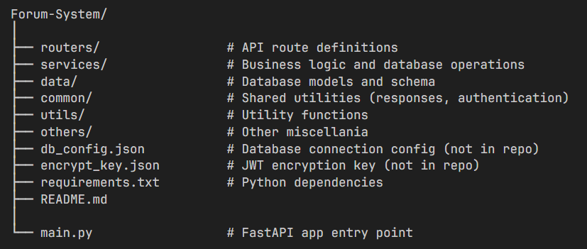

*A full-featured forum system built with FastAPI and MariaDB, supporting user authentication, topic discussions, replies, private messaging, voting, and category management.*

## Table of Contents
- [Table of Contents](#table-of-contents)
- [Features](#features)
- [Project Structure](#project-structure)
- [Database Diagram](#database-eer-diagram)
- [Setup](#setup)
- [API Overview](#api-overview)
- [License](#license)

## Features

- **User Authentication:** Register, login, and JWT-based authentication.
- **Topic Discussions:** Create, view, and reply to topics.
- **Categories:** Organize topics into categories, with privacy and locking controls.
- **Voting:** Upvote or downvote replies.
- **Conversations:** Private messaging between users.
- **Admin Controls:** Category creation and privacy management.

## Project Structure


## Database EER Diagram


## Setup

1. **Clone the repository: **
   ```sh
   git clone <repo-url>
   cd Forum-System
   ```

2. **Install dependencies:**
   ```sh
   pip install -r requirements.txt
   ```

3. **Configure the database:**
   - Create a `db_config.json` file in the root directory:
     ```json
     {
       "user": "your_db_user",
       "password": "your_db_password",
       "host": "localhost",
       "port": 3306,
       "database": "forum_system_db"
     }
     ```
   - Import the schema from db_schema.sql into your MariaDB/MySQL server.

4. **Set up JWT encryption:**
   - Create an encrypt_key.json file:
     ```json
     { 
       "key": "your_secret_key" 
     }
     ```

5. **Run the application:**
   ```sh
   python main.py
   ```
   The API will be available at [http://localhost:8000](http://localhost:8000).

## API Overview

- **Users:** users (register, login, info)
- **Topics:** `/topics` (list, create, reply, vote, select best reply)
- **Categories:** `/categories` (list, create, update privacy, topics by category)
- **Conversations:** `/conversations` (private messaging)

Interactive API docs available at [http://localhost:8000/docs](http://localhost:8000/docs).

## License

This project is licensed under the MIT License. View [LICENSE](./LICENSE) for details.
