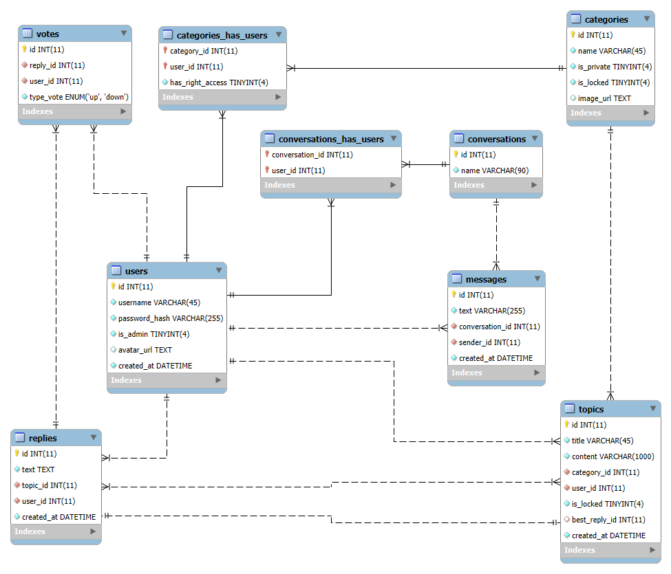

# Forum System


[](https://www.python.org/)
[](LICENSE)

*A full-featured forum system built with FastAPI and MariaDB, supporting user authentication, topic discussions, replies, private messaging, voting, and category management.*

---

## Table of Contents
- [Features](#features)
- [Project Structure](#project-structure)
- [Database EER Diagram](#database-eer-diagram)
- [Quickstart](#quickstart)
- [Setup](#setup)
- [API Overview](#api-overview)
  - [Authentication](#authentication)
  - [Users](#users)
  - [Conversations](#conversations)
  - [Topics](#topics)
  - [Categories](#categories)
  - [Notes](#notes)
- [License](#license)

---

## Features

- **User Authentication:** Register, login, and JWT-based authentication.
- **Topic Discussions:** Create, view, and reply to topics.
- **Categories:** Organize topics into categories, with privacy and locking controls.
- **Voting:** Upvote or downvote replies.
- **Conversations:** Private messaging between users.
- **Admin Controls:** Category creation and privacy management.

---

## Project Structure

```sh
Forum-System/
│
├── routers/                 # API route definitions
├── services/                # Business logic and database operations
├── data/                    # Database models and schema
├── common/                  # Shared utilities (responses, authentication)
├── utils/                   # Utility functions
├── others/                  # Other miscellania
├── db_config.json           # Database connection config (not in repo)
├── encrypt_key.json         # JWT encryption key (not in repo)
├── requirements.txt         # Python dependencies
├── README.md
│
└── main.py                  # FastAPI app entry point
```

---

## Database EER Diagram



---

## Setup

1. **Clone the repository:**
   ```sh
   git clone <repo-url>
   ```

2. **Navigate to the repository root:**
   ```sh
   cd Forum-System
   ```

3. **Install project dependencies:**
   ```sh
   pip install -r requirements.txt
   ```

4. **Setup a working MariaDB server:**
   - **Option 1:** Download and install from the [official MariaDB page](https://mariadb.org/download/).
   - **Option 2:** Setup a MariaDB container with Docker:
     - Pull MariaDB:
        ```sh
        docker pull mariadb
        ```
     - Run MariaDB:
        ```sh
        docker run -p 3306:3306 --name <NAME> -e MYSQL_ROOT_PASSWORD=<PASSWORD> -d mariadb:latest
        ```

5. **Configure the project environment:**

   - Create a `.env` file in the root directory:

     ```sh
     # ================= PRIVATE MariaDB Connection Params =================
     DB_USER=your_db_user
     DB_PASSWORD=your_db_password
     DB_HOST=your_host_address
     DB_PORT=your_host_port
     DB_NAME=forum_system_db
     # =====================================================================

     # ==================== PRIVATE JWT Encryption Key =====================
     ENCRYPT_KEY=your_secret_key
     # =====================================================================

     # =============== PRIVATE Cloudinary Config (Optional) ================
     CLDNR_CLOUD_NAME=your_cloudinary_cloud_name
     CLDNR_API_KEY=your_cloudinary_api_key
     CLDNR_API_SECRET=your_cloudinary_api_secret
     # =====================================================================
     ```

   - Import the schema from `db_schema.sql` (located in the `data` folder) into your running MariaDB server.

---

## API Overview

> **Interactive API docs available at:** [http://localhost:8000/docs](http://localhost:8000/docs)

### API Endpoints Summary

| Method | Endpoint                                           | Description                      | Auth Required |
| ------ | -------------------------------------------------- | -------------------------------- | ------------- |
| POST   | `/api/users/login`                                 | Authenticate user                | No            |
| POST   | `/api/users/register`                              | Register new user                | No            |
| GET    | `/api/users/info`                                  | Get current user info            | Yes           |
| GET    | `/api/conversations/`                              | List user's conversations        | Yes           |
| GET    | `/api/conversations/{conversation_id}`             | Get conversation details         | Yes           |
| POST   | `/api/conversations/`                              | Create new conversation          | Yes           |
| POST   | `/api/conversations/{conversation_id}`             | Add message to conversation      | Yes           |
| PUT    | `/api/conversations/{conversation_id}/users`       | Add user to conversation         | Yes           |
| DELETE | `/api/conversations/{conversation_id}/users`       | Remove user from conversation    | Yes           |
| GET    | `/api/topics/`                                     | List topics (filter/sort/search) | No            |
| GET    | `/api/topics/{topic_id}/`                          | Get topic with replies           | No            |
| POST   | `/api/topics/`                                     | Create topic                     | Yes           |
| POST   | `/api/topics/{topic_id}/replies/`                  | Add reply to topic               | Yes           |
| POST   | `/api/topics/{topic_id}/replies/{reply_id}/votes/` | Vote on a reply                  | Yes           |
| POST   | `/api/topics/{topic_id}/best/`                     | Mark reply as best               | Yes           |
| PATCH  | `/api/topics/{topic_id}/lock/`                     | Lock topic                       | Yes           |
| GET    | `/api/categories`                                  | List categories                  | No            |
| GET    | `/api/categories/{category_id}/topics`             | List topics in category          | No            |
| POST   | `/api/categories/`                                 | Create category                  | Yes           |
| PATCH  | `/api/categories/{category_id}/privacy`            | Update category privacy          | Yes           |
| PATCH  | `/api/categories/{category_id}/lock`               | Lock category                    | Yes           |

---

### Authentication

All authenticated endpoints require a user token (`u-token`) in the request headers.

---

### Users

#### **POST** `/api/users/login`
- **Purpose:** Authenticate an existing user.
- **Request Body:** User credentials (username and password).
- **Response:** User authentication token (`u-token`).

#### **POST** `/api/users/register`
- **Purpose:** Create a new user account.
- **Request Body:** User credentials (username and password).
- **Response:** Account creation status.

#### **GET** `/api/users/info`
- **Purpose:** Retrieve current user's profile information.
- **Authentication:** Required (`u-token`).
- **Response:** User profile data.

---

### Conversations

#### **GET** `/api/conversations/`
- **Purpose:** Retrieve user's conversations.
- **Authentication:** Required (`u-token`).
- **Query Parameters:** `contains_user` (optional)
- **Response:** List of conversation summaries.

#### **GET** `/api/conversations/{conversation_id}`
- **Purpose:** Get details of a specific conversation.
- **Authentication:** Required (`u-token`).
- **Response:** Conversation details and messages.

#### **POST** `/api/conversations/`
- **Purpose:** Create a new conversation.
- **Authentication:** Required (`u-token`).
- **Request Body:** Conversation details and participants.

#### **POST** `/api/conversations/{conversation_id}`
- **Purpose:** Add a new message to a conversation.
- **Authentication:** Required (`u-token`).
- **Request Body:** Message content.

#### **PUT** `/api/conversations/{conversation_id}/users`
- **Purpose:** Add a user to a conversation.
- **Authentication:** Required (`u-token`).
- **Request Body:** Username to add.

#### **DELETE** `/api/conversations/{conversation_id}/users`
- **Purpose:** Remove a user from a conversation.
- **Authentication:** Required (`u-token`).
- **Request Body:** Username to remove.

---

### Topics

#### **GET** `/api/topics/`
- **Purpose:** Retrieve topics with filtering.
- **Query Parameters:** `sort`, `sort_by`, `search`
- **Response:** Paginated list of topics.

#### **GET** `/api/topics/{topic_id}/`
- **Purpose:** Retrieve a specific topic with its replies.
- **Response:** Topic and replies.

#### **POST** `/api/topics/`
- **Purpose:** Create a new topic in a category.
- **Authentication:** Required (`u-token`).
- **Request Body:** Topic details and category ID.

#### **POST** `/api/topics/{topic_id}/replies/`
- **Purpose:** Add a reply to a topic.
- **Authentication:** Required (`u-token`).
- **Request Body:** Reply content.

#### **POST** `/api/topics/{topic_id}/replies/{reply_id}/votes/`
- **Purpose:** Vote on a reply.
- **Authentication:** Required (`u-token`).
- **Request Body:** Vote type (up/down).

#### **POST** `/api/topics/{topic_id}/best/`
- **Purpose:** Mark a reply as the best.
- **Authentication:** Required (`u-token`).
- **Request Body:** Reply ID.

#### **PATCH** `/api/topics/{topic_id}/lock/`
- **Purpose:** Lock a topic.
- **Authentication:** Required (`u-token`).
- **Request Body:** New locked status.

---

### Categories

#### **GET** `/api/categories`
- **Purpose:** Retrieve all categories.
- **Response:** List of categories.

#### **GET** `/api/categories/{category_id}/topics`
- **Purpose:** Retrieve topics in a category.
- **Query Parameters:** `sort`, `sort_by`, `search`
- **Response:** Paginated list of topics.

#### **POST** `/api/categories/`
- **Purpose:** Create a new category.
- **Authentication:** Required (`u-token`).
- **Request Body:** Category details.

#### **PATCH** `/api/categories/{category_id}/privacy`
- **Purpose:** Update category privacy.
- **Authentication:** Required (`u-token`).
- **Request Body:** New privacy status.

#### **PATCH** `/api/categories/{category_id}/lock`
- **Purpose:** Lock a category.
- **Authentication:** Required (`u-token`).
- **Response:** Updated category.

---

### Notes

- Error responses include appropriate HTTP status codes and error messages.
- Refer to the [Interactive API documentation](http://localhost:8000/docs) for up-to-date request/response formats.

---

## License

This project is licensed under the MIT License. View [LICENSE](./LICENSE) for details.