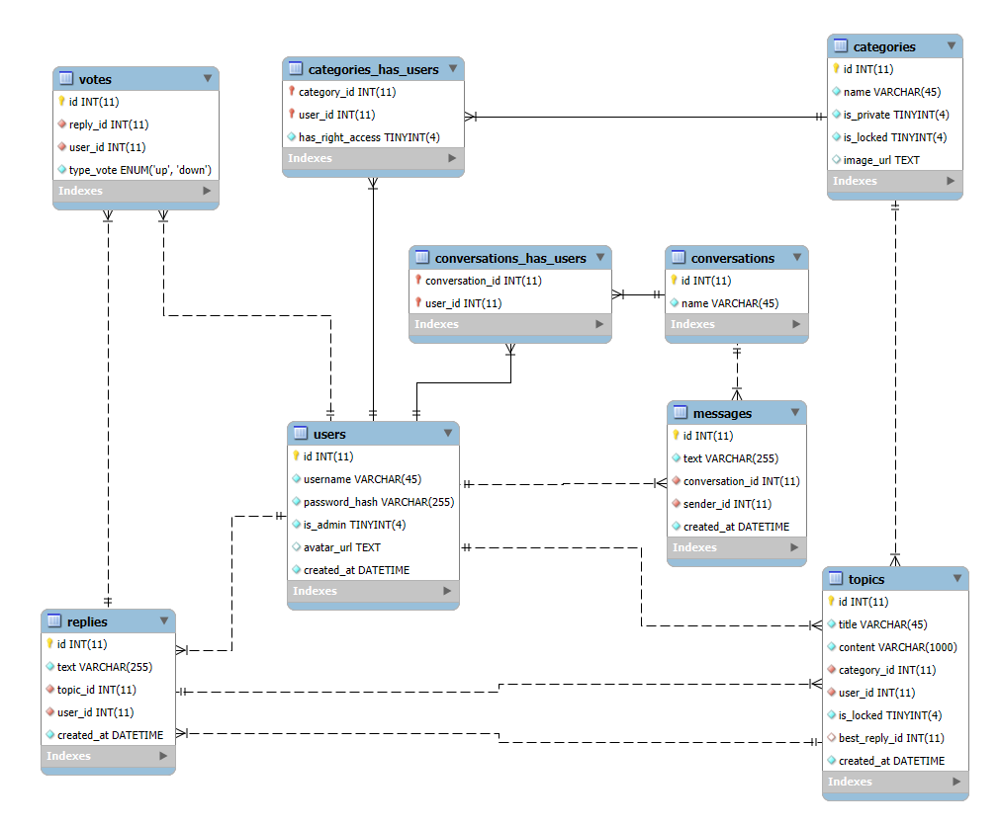

*A full-featured forum system built with FastAPI and MariaDB, supporting user authentication, topic discussions, replies, private messaging, voting, and category management.*

## Table of Contents
- [Table of Contents](#table-of-contents)
- [Features](#features)
- [Project Structure](#project-structure)
- [Database EER Diagram](#database-eer-diagram)
- [Setup](#setup)
- [API Overview](#api-overview)
  - [Authentication](#authentication)
  - [Users](#users)
  - [Conversations](#conversations)
  - [Topics](#topics)
  - [Categories](#categories)
  - [Notes](#notes)
- [License](#license)

## Features

- **User Authentication:** Register, login, and JWT-based authentication.
- **Topic Discussions:** Create, view, and reply to topics.
- **Categories:** Organize topics into categories, with privacy and locking controls.
- **Voting:** Upvote or downvote replies.
- **Conversations:** Private messaging between users.
- **Admin Controls:** Category creation and privacy management.

## Project Structure
```sh
Forum-System/
│
├── routers/                 # API route definitions
├── services/                # Business logic and database operations
├── data/                    # Database models and schema
├── common/                  # Shared utilities (responses, authentication)
├── utils/                   # Utility functions
├── others/                  # Other miscellania
├── db_config.json           # Database connection config (not in repo)
├── encrypt_key.json         # JWT encryption key (not in repo)
├── requirements.txt         # Python dependencies
├── README.md
│
└── main.py                  # FastAPI app entry point
```

## Database EER Diagram


## Setup

1. **Clone the repository:**
   ```sh
   git clone <repo-url>
   cd Forum-System
   ```

2. **Install dependencies:**
   ```sh
   pip install -r requirements.txt
   ```

3. **Configure the database:**
   - Create a `db_config.json` file in the root directory:
     ```json
     {
       "user": "your_db_user",
       "password": "your_db_password",
       "host": "localhost",
       "port": 3306,
       "database": "forum_system_db"
     }
     ```
   - Import the schema from db_schema.sql into your MariaDB/MySQL server.

4. **Set up JWT encryption:**
   - Create an encrypt_key.json file:
     ```json
     { 
       "key": "your_secret_key" 
     }
     ```

5. **Run the application:**
   ```sh
   python main.py
   ```
   The API will be available at [http://localhost:8000](http://localhost:8000).

## API Overview

This section provides a comprehensive guide to the available API endpoints, organized by resource type. All endpoints requiring authentication are marked with `(requires u-token)`.

### Authentication
All authenticated endpoints require a user token (`u-token`) to be included in the request headers.

### Users
User-related endpoints for authentication and profile management:

- `POST /users/login`
  - **Purpose**: Authenticate an existing user.
  - **Request Body**: User credentials (username and password).
  - **Response**: User authentication token (`u-token`).

- `POST /users/register`
  - **Purpose**: Create a new user account.
  - **Request Body**: User registration details (username and password).
  - **Response**: Information about if account is created or not.

- `GET /users/info`
  - **Purpose**: Retrieve current user's profile information.
  - **Authentication**: Required (u-token).
  - **Response**: User profile data.

### Conversations
Endpoints for managing user conversations:

- `GET /conversations/`
  - **Purpose**: Retrieve user's conversations.
  - **Authentication**: Required (u-token).
  - **Query Parameters**:
    - `contains_user` (optional): Filter conversations by username.
  - **Response**: List of conversation summaries.

- `GET /conversations/{conversation_id}`
  - **Purpose**: Get details of a specific conversation.
  - **Authentication**: Required (u-token).
  - **Response**: Full conversation details including messages.

- `POST /conversations/`
  - **Purpose**: Create a new conversation.
  - **Authentication**: Required (u-token).
  - **Request Body**: Conversation details and initial participants.

- `POST /conversations/{conversation_id}`
  - **Purpose**: Add a new message to a conversation.
  - **Authentication**: Required (u-token).
  - **Request Body**: Message content.

- `PUT /conversations/{conversation_id}/users`
  - **Purpose**: Add a new user to a conversation.
  - **Authentication**: Required (u-token).
  - **Request Body**: Username to add.

- `DELETE /conversations/{conversation_id}/users`
  - **Purpose**: Remove a user from a conversation.
  - **Authentication**: Required (u-token).
  - **Request Body**: Username to remove.

### Topics
Endpoints for managing topics:

- `GET /topics/`
  - **Purpose**: Retrieve topics with advanced filtering.
  - **Query Parameters**:
    - `sort`: Sorting order ("asc" or "desc").
    - `sort_by`: Attribute to sort by (e.g., "title", "content").
    - `search`: Filter topics by title.
  - **Response**: Paginated list of topics.

- `GET /topics/{topic_id}/`
  - **Purpose**: Retrieve a specific topic with its replies.
  - **Response**: Topic information and associated replies.

- `POST /topics/`
  - **Purpose**: Create a new topic in a specific category.
  - **Authentication**: Required (u-token).
  - **Request Body**: Topic details and category ID.
  - **Response**: Topic information.

- `POST /topics/{topic_id}/replies/`
  - **Purpose**: Add a reply to a topic.
  - **Authentication**: Required (u-token).
  - **Request Body**: Reply content.
  - **Response**: Created reply content.

- `POST /topics/{topic_id}/replies/{reply_id}/votes/`
  - **Purpose**: Vote on a specific reply.
  - **Authentication**: Required (u-token).
  - **Request Body**: Vote type (up/down).
  - **Response**: Created vote type.

- `POST /topics/{topic_id}/best/`
  - **Purpose**: Mark a reply as the best.
  - **Authentication**: Required (u-token).
  - **Request Body**: Reply ID to mark as best.

- `PATCH /topics/{topic_id}/lock/`
  - **Purpose**: Lock a topic to prevent further replies.
  - **Authentication**: Required (u-token).
  - **Request Body**: New locked status.
  - **Response**: The updated topic.

### Categories
Endpoints for managing discussion categories:

- `GET /categories`
  - **Purpose**: Retrieve all available categories.
  - **Response**: List of category summaries.

- `GET /categories/{category_id}/topics`
  - **Purpose**: Retrieve topics within a specific category.
  - **Query Parameters**:
    - `sort`: Sorting order ("asc" or "desc").
    - `sort_by`: Attribute to sort by.
    - `search`: Filter topics by title.
  - **Response**: Paginated list of topics in the given category.

- `POST /categories/`
  - **Purpose**: Create a new category.
  - **Authentication**: Required (u-token).
  - **Request Body**: Category details.
  - **Response**: The newly created category.

- `PATCH /categories/{category_id}/privacy`
  - **Purpose**: Update a category's privacy settings.
  - **Authentication**: Required (u-token).
  - **Request Body**: New privacy status.

- `PATCH /categories/{category_id}/lock`
  - **Purpose**: Lock a category to prevent new topics in it.
  - **Authentication**: Required (u-token).
  - **Response**: The updated category.

### Notes
- Error responses will include appropriate HTTP status codes and error messages.
- Always refer to the Interactive API documentation for the most up-to-date information on request/response formats, located at: [http://localhost:8000/docs](http://localhost:8000/docs).

## License

This project is licensed under the MIT License. View [LICENSE](./LICENSE) for details.
